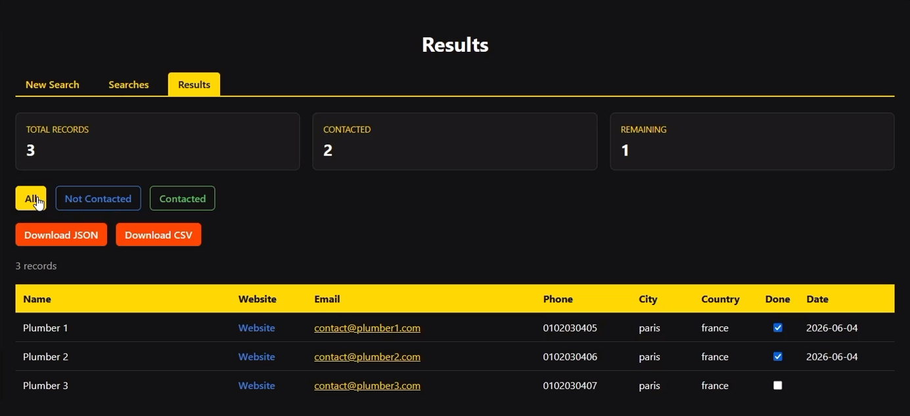

<p align="center">
  
</p>

> 🇬🇧 English | [🇫🇷 Français](./README_FR.md)


<p align="center">
  <a href="https://palks-studio.com">
    
  </a>
</p>


# Data Collection System

> ⚠️ This repository presents the project and its technical documentation.  
> The production version is not publicly distributed.

> The data shown in the video demonstration is fictitious. For confidentiality reasons, it was not possible to display the actual data collected by the system.

A modular data collection, processing, and export platform.

It allows you to collect information from one or multiple sources, clean and validate the data, and export it in usable formats.

The system is built around a simple principle: each component has a single responsibility.

Collectors gather data, processors clean and prepare it, exporters generate the final files, and the main engine orchestrates the workflow.

This approach keeps the system readable, maintainable, and extensible, whether it's a small collection project or a full prospecting/data gathering platform.

Key features:

- Search management  
- Multi-collector architecture  
- Data cleaning and normalization  
- Data validation  
- Duplicate removal  
- CSV and JSON export  
- Logging and error handling  
- Automatic retries  
- Tracking contacted prospects  
- Web interface for managing searches and results

---

## Overview

The system workflow is built on a sequential processing chain to ensure data quality at every stage.

```text
Load configuration
↓
Initialize environment
↓
Load queries
↓
Execute collectors
↓
Clean data
↓
Normalize data
↓
Validate data
↓
Remove duplicates
↓
Generate exports
↓
Log execution
```


Each component remains independent to facilitate maintenance, updates, and the addition of new features.

New collectors, processors, exporters, or interfaces can be integrated without impacting the existing architecture.

The current version serves as the technical foundation of the system and will support future functionalities for data collection, enrichment, and exploitation.

---

## Structure

```
data-collection-system/
│
├── main.py                            → System entry point, orchestrates the entire workflow
├── requirements.txt                   → List of external Python dependencies
├── run.bat                            → Starts the local application server
│
├── config/
│   ├── __init__.py                    → Declares the directory as a Python package
│   └── settings.py                    → Centralizes the system's technical configuration
│
├── collectors/
│   ├── __init__.py                    → Declares the directory as a Python package
│   ├── duckduckgo_collector.py        → Collects data from a business directory source
│   ├── bing_collector.py              → Collects data from Bing
│   ├── qwant_collector.py             → Collects data from Qwant
│   ├── source_registry.py             → Registers and returns the system's active collectors
│   └── base_collector.py              → Defines the common contract all collectors must follow
│
├── processors/
│   ├── __init__.py                    → Declares the directory as a Python package
│   ├── cleaner.py                     → Cleans collected data before processing
│   ├── validator.py                   → Validates data integrity and required fields
│   ├── deduplicator.py                → Removes duplicate records from the dataset
│   ├── email_extractor.py             → Contains functions for extracting email addresses from visited websites
│   ├── phone_extractor.py             → Contains functions for extracting phone numbers from visited websites
│   └── normalizer.py                  → Standardizes formats and normalizes values
│
├── exports/
│   ├── __init__.py                    → Declares the directory as a Python package
│   ├── csv_exporter.py                → Exports processed data to CSV format
│   └── json_exporter.py               → Exports processed data to JSON format
│
├── core/
│   ├── __init__.py                    → Declares the directory as a Python package
│   ├── logger.py                      → Records system events, errors, and execution logs
│   ├── retry_handler.py               → Automatically retries failed operations
│   ├── error_handler.py               → Centralizes error handling and processing
│   └── folder_initializer.py          → Automatically creates required directories at startup
│
├── models/
│   ├── __init__.py                    → Declares the directory as a Python package
│   └── company.py                     → Defines the company data structure used throughout the system
│
├── data/
│   ├── prospected.json                → History of previously contacted prospects and associated prospecting dates
│   └── processed/                     → Stores cleaned, validated, and export-ready data
│
├── logs/
│   └── app.log                        → System log containing events, errors, and execution records
│
├── searches/
│   ├── __init__.py                    → Declares the directory as a Python package
│   ├── search_manager.py              → Manages the loading, storage, and execution of searches
│   └── searches.json                  → Stores user-defined search configurations
│
├── web/
│   ├── __init__.py                    → Declares the directory as a Python package
│   ├── app.py                         → Main Flask application, provides routes for searches, execution, results, and the user interface
│   │
│   └── templates/
│       ├── edit_searches.html         → Edit the settings of an existing search
│       ├── results.html               → Displays collected data, filtering options, and prospect tracking
│       ├── running.html               → Progress screen displayed while a search is running
│       ├── searches.html              → List of saved searches
│       └── new_search.html            → Create a new search
│
├── LICENSE.md                         → Terms of use and legal framework
└── docs/
    ├── INSTALL.md                     → Provides step-by-step instructions for setting up and running the system
    ├── GUIDE.md                       → User guide
    └── README.md                      → General system documentation
```


---

## Features

> To install and start the application, please follow the detailed instructions in docs/INSTALL.md.

### Search Management

The system allows you to create, save, and execute custom searches.

Each search can include different criteria such as keywords, geographic areas, or parameters specific to a data source.

Searches are stored centrally and can be reused in future runs.

---

### Data Collection

The collection engine retrieves information from one or more sources.

The architecture relies on independent collectors, making it easy to add new sources without modifying the rest of the application.

---

### Data Cleaning

Collected data is automatically cleaned before processing.

This step removes unnecessary spaces, corrects certain formats, and prepares the data for subsequent stages.

---

### Normalization

The system standardizes values to ensure overall data consistency.

This facilitates comparisons, searches, and deduplication operations.

---

### Validation

Each record is checked to verify the presence and consistency of required information.

Invalid data can be rejected before export.

---

### Deduplication

The engine automatically detects and removes duplicates from collected results.

This step improves export quality and reduces noise in datasets.

---

### Data Export

Results can be exported in various formats for use with other tools or systems.

Currently supported formats:

- CSV  
- JSON

---

### Logging

All important system events are recorded in log files.

This feature simplifies error diagnosis and execution monitoring.

---

### Error Handling

The system centralizes error processing to ensure consistent behavior when incidents occur.

---

### Automatic Retry

Certain operations can be automatically retried when a temporary failure is detected.

This feature improves the overall reliability of the system.

---

### Prospect Tracking

The system maintains a list of previously contacted prospects to prevent duplicate outreach and facilitate activity tracking.

---

### Web Interface

The architecture already includes the components required for a web interface that allows users to manage searches, data collection, and exports through a graphical interface.

---

### 1. Load Configuration

The system loads all technical and functional parameters required for execution.

This includes:

- Storage paths  
- Export settings  
- Timeout settings  
- Execution limits  
- Logging options

---

### 2. Initialize Environment

Required directories are automatically created if needed.

This step ensures the environment is ready before any collection operations.

---

### 3. Load Searches

Saved searches are loaded from the search manager.

Each search contains the criteria that will be used by the collectors.

---

### 4. Load Collectors

The collector registry provides the list of active sources to use during execution.

This architecture allows adding new sources without modifying the main engine.

---

### 5. Collect Data

Collectors retrieve data from the configured sources.

Results are converted into a structured format compatible with the rest of the system.

---

### 6. Clean Data

Collected data is prepared for subsequent steps.

This phase removes unnecessary spaces and corrects simple inconsistencies.

---

### 7. Normalize Data

Values are harmonized to ensure a consistent format across the entire dataset.

---

### 8. Validate Data

Records are checked to ensure required information is present and usable.

Invalid data can be rejected.

---

### 9. Remove Duplicates

The system detects and removes identical or redundant records to improve final data quality.

---

### 10. Generate Exports

Validated data is exported using the configured formats.

Currently supported formats:

- CSV  
- JSON

---

### 11. Logging

Important events, errors, and execution details are recorded in the system logs.

---

### 12. Execution Complete

The workflow ends after file generation and the recording of execution information.

Results are then available in the project's export directories.

---

### Web Interface

#### web/

The system includes a web interface to manage searches, run collections, and view results in a browser.

The interface allows:

- Creating new searches  
- Editing existing searches  
- Deleting searches  
- Manually running collections  
- Viewing results  
- Tracking previously contacted prospects

---

## Data Flow

The data flow describes the complete path of information from collection to final export.

Each step occurs at a precise point to ensure quality, consistency, and usability of the results.

---

### Overview

```text
User Search
↓
Collector
↓
Collected Data
↓
Cleaning
↓
Normalization
↓
Validation
↓
Deduplication
↓
Export
```


---

### Step 1: User Search

The process begins with a search saved in the system.

Example:

```json
{
    "id": 1,
    "name": "Paris Plumbers",
    "keyword": "plumber",
    "city": "Paris",
    "enabled": true
}
```


This search defines the criteria that will be used by the collectors.

---

### Step 2: Data Collection

The collector retrieves information from one or more sources.

The data is converted into a structured format shared across the entire system.

Example:

```json
{
    "name": "Example Company",
    "website": "https://example.com",
    "email": "contact@example.com",
    "phone": "+33123456789",
    "city": "Paris",
    "country": "France",
    "sector": "keyword",
    "source": "Directory",
    "processed": false
}
```


---

### Step 3: Data Cleaning

Data is cleaned to remove unnecessary or inconsistent elements.

Examples:

- Remove unnecessary spaces  
- Convert empty values  
- Prepare string fields

---

### Step 4: Normalization

Values are standardized to ensure a consistent format.

Examples:

```text
PARIS
Paris
paris
```


become:

```text
Paris
```


This step improves the overall consistency of the dataset.

---

### Step 5: Validation

Each record is checked to ensure that required information is present.

Example:

```text
Name
Website
```


Incomplete or invalid records can be rejected.

---

### Step 6: Deduplication

The system searches for potential duplicates and keeps only unique records.

This step improves export quality and reduces redundant data.

---

### Step 7: Export

Validated data is exported in the configured formats.

Currently supported formats:

- CSV  
- JSON

Exports are generated in:

```text
data/processed/
```


---

### Step 8: Logging

Important events are recorded in:

```text
logs/app.log
```


Examples:

```text
Application started
Collection started
250 records collected
Export completed
```


This step allows tracking system behavior and facilitates diagnostics in case of incidents.

---

## Usage

### Management Interface

The web interface architecture is already integrated into the project.

The goal is to enable creation, modification, and execution of searches from a dedicated web interface.

Available features:

- Create a search  
- Edit an existing search  
- Delete a search  
- Select collectors  
- Manually run collections  
- View results  
- Track previously contacted prospects

---

### Proposed User Workflow

```text
Create a search
↓
Save
↓
Start collection
↓
Process data
↓
Generate exports
↓
View results
```


---

## Design Principles

The system was built around several core principles to ensure robustness, maintainability, and scalability.

### Single Responsibility

Each component has a clearly defined responsibility.

This approach simplifies development, testing, and future enhancements.

### Modular Architecture

Different modules can evolve independently.

Adding a new collector or exporter does not require changes to the system core.

### Extensibility

The architecture allows for easy addition of new data sources, processing steps, or export formats.

### Maintainability

The project structure is designed to facilitate code understanding and long-term maintenance.

### Robustness

The system includes validation, logging, error handling, and automatic retry mechanisms to improve reliability.

---

## Security

Data security and integrity are key aspects of the architecture.

Currently implemented features:

- Validation of collected data  
- Centralized error handling  
- Event logging  
- Automatic retries  
- Component isolation  
- Controlled processing flows

The architecture also allows for the future addition of supplementary security mechanisms as needed.

---

© Palks Studio — see LICENSE.md  
- https://palks-studio.com