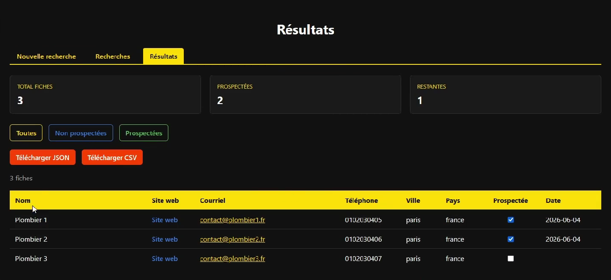

<p align="center">
  
</p>

> 🇫🇷 Français | [🇬🇧 English](./README.md)


<p align="center">
  <a href="https://palks-studio.com">
    
  </a>
</p>


# Data Collection System

> ⚠️ Ce dépôt présente le projet et sa documentation technique.  
> La version de production n’est pas distribuée publiquement.

> Les données visibles dans la démonstration vidéo sont fictives, par souci de confidentialité, il m'était impossible d'afficher les vraies données collectées.

Data Collection System est une plateforme modulaire de collecte, de traitement et d’export de données structurées.

Elle permet de récupérer des informations depuis une ou plusieurs sources, de nettoyer et valider les données, puis de les exporter dans des formats exploitables.

Le système est conçu autour d’un principe simple : chaque composant possède une responsabilité unique.

Les collecteurs récupèrent les données, les processeurs les préparent, les exporteurs génèrent les fichiers finaux, et le moteur principal orchestre le workflow.

Cette approche rend le système lisible, maintenable et facilement extensible, que ce soit pour un simple projet de collecte ou une plateforme complète de prospection et de constitution de bases de données.

## Fonctionnalités principales

- Gestion des recherches  
- Architecture multi-collecteurs  
- Nettoyage et normalisation des données  
- Validation des informations collectées  
- Suppression des doublons  
- Export CSV et JSON  
- Journalisation et gestion des erreurs  
- Mécanismes de réessai automatique  
- Suivi des prospects déjà contactés  
- Interface web intégrée pour la gestion des recherches et des résultats

---

## Présentation

Le workflow du système repose sur une chaîne de traitement séquentielle permettant de garantir la qualité des données à chaque étape.

```text
Chargement de la configuration
↓
Initialisation de l'environnement
↓
Chargement des recherches
↓
Exécution des collecteurs
↓
Nettoyage des données
↓
Normalisation des données
↓
Validation des données
↓
Suppression des doublons
↓
Génération des exports
↓
Journalisation de l'exécution
```

Chaque composant reste indépendant afin de faciliter la maintenance, les évolutions et l'ajout de nouvelles fonctionnalités.

De nouveaux collecteurs, processeurs, exporteurs ou interfaces peuvent être intégrés sans remettre en cause l'architecture existante.

La version actuelle constitue le socle technique du système et servira de fondation aux futures fonctionnalités de collecte, d'enrichissement et d'exploitation des données.

---

## Structure

```
data-collection-system/
│
├── main.py                            → Point d'entrée du système, orchestre l'ensemble du workflow
├── requirements.txt                   → Liste des dépendances Python externes du projet
├── run.bat                            → Lance le serveur local de l'application
│
├── config/
│   ├── __init__.py                    → Déclare le dossier comme package Python
│   └── settings.py                    → Centralise la configuration technique du système
│
├── collectors/
│   ├── __init__.py                    → Déclare le dossier comme package Python
│   ├── duckduckgo_collector.py        → Collecte les données depuis une source d'entreprises
│   ├── bing_collector.py              → Collecte les données depuis une source d'entreprises
│   ├── qwant_collector.py             → Collecte les données depuis une source d'entreprises
│   ├── source_registry.py             → Référence et retourne les collecteurs actifs du système
│   └── base_collector.py              → Définit le contrat commun que tous les collecteurs doivent respecter
│
├── processors/
│   ├── __init__.py                    → Déclare le dossier comme package Python
│   ├── cleaner.py                     → Nettoie les données collectées avant traitement
│   ├── validator.py                   → Vérifie la validité et la présence des champs obligatoires
│   ├── deduplicator.py                → Supprime les doublons du jeu de données
│   ├── email_extractor.py             → Contient les fonctions pour extraire les adresses email depuis les sites web visités
│   ├── phone_extractor.py             → Contient les fonctions pour extraire les numéros de téléphone depuis les sites web visités
│   └── normalizer.py                  → Uniformise les formats et standardise les valeurs
│
├── exports/
│   ├── __init__.py                    → Déclare le dossier comme package Python
│   ├── csv_exporter.py                → Exporte les données traitées au format CSV
│   └── json_exporter.py               → Exporte les données traitées au format JSON
│
├── core/
│   ├── __init__.py                    → Déclare le dossier comme package Python
│   ├── logger.py                      → Enregistre les événements, erreurs et actions du système
│   ├── retry_handler.py               → Réessaie automatiquement les opérations ayant échoué
│   ├── error_handler.py               → Centralise la gestion et le traitement des erreurs
│   └── folder_initializer.py          → Crée automatiquement les dossiers nécessaires au démarrage
│
├── models/
│   ├── __init__.py                    → Déclare le dossier comme package Python
│   └── company.py                     → Définit la structure d'une entreprise au sein du système
│
├── data/
│   ├── prospected.json                → Historique des prospects déjà contactés et date de prospection associée
│   └── processed/                     → Stocke les données nettoyées, validées et exportables
│
├── logs/
│   └── app.log                        → Journal des événements, erreurs et exécutions du système
│
├── searches/
│   ├── __init__.py                    → Déclare le dossier comme package Python
│   ├── search_manager.py              → Gère le chargement, l'enregistrement et l'exécution des recherches
│   └── searches.json                  → Stocke les recherches configurées par l'utilisateur
│
├── web/
│   ├── __init__.py                    → Déclare le dossier comme package Python
│   ├── app.py                         → Application Flask principale, routes pour les recherches, exécution, résultats et interface utilisateur
│   │
│   └── templates/
│       ├── edit_searches.html         → Modification des paramètres d'une recherche existante
│       ├── results.html               → Affichage des données collectées, filtrage et suivi des prospects
│       ├── running.html               → Écran de progression lors de l'exécution d'une recherche
│       ├── searches.html              → Liste des recherches enregistrées
│       └── new_search.html            → Création d'une nouvelle recherche
│
├── LICENCE.md                         → Conditions d’utilisation et cadre légal
└── docs/
    ├── INSTALL_FR.md                  → Fournit les instructions d'installation et de démarrage du système étape par étape
    ├── GUIDE_FR.md                    → Guide utilisateur
    └── README_FR.md                   → Documentation générale du système
```


---

## Fonctionnalités

> Pour démarrer l'application et l'installer, veuillez suivre le guide détaillé dans docs/INSTALL_FR.md.

### Gestion des recherches

Le système permet de créer, enregistrer et exécuter des recherches personnalisées.

Chaque recherche peut contenir différents critères tels que des mots-clés, des zones géographiques ou des paramètres spécifiques à une source de données.

Les recherches sont stockées de manière centralisée et peuvent être réutilisées lors de futures exécutions.

---

### Collecte de données

Le moteur de collecte permet de récupérer des informations depuis une ou plusieurs sources.

L'architecture repose sur un système de collecteurs indépendants facilitant l'ajout de nouvelles sources sans modifier le reste de l'application.

---

### Nettoyage des données

Les données collectées sont automatiquement nettoyées avant leur traitement.

Cette étape permet notamment de supprimer les espaces inutiles, de corriger certains formats et de préparer les données pour les étapes suivantes.

---

### Normalisation

Le système uniformise les valeurs afin de garantir une cohérence globale des données.

Cette étape facilite les comparaisons, les recherches et les opérations de déduplication.

---

### Validation

Chaque enregistrement est contrôlé afin de vérifier la présence et la cohérence des informations obligatoires.

Les données invalides peuvent être rejetées avant leur export.

---

### Déduplication

Le moteur détecte et supprime automatiquement les doublons présents dans les résultats collectés.

Cette étape améliore la qualité des exports et réduit le bruit dans les jeux de données.

---

### Export des données

Les résultats peuvent être exportés dans différents formats afin d'être exploités par d'autres outils ou systèmes.

Formats actuellement pris en charge :

- CSV
- JSON

---

### Journalisation

L'ensemble des événements importants du système est enregistré dans les fichiers de logs.

Cette fonctionnalité facilite le diagnostic des erreurs et le suivi des exécutions.

---

### Gestion des erreurs

Le système centralise le traitement des erreurs afin de garantir un comportement cohérent lors des incidents.

---

### Réessai automatique

Certaines opérations peuvent être automatiquement relancées lorsqu'un échec temporaire est détecté.

Cette fonctionnalité améliore la robustesse globale du système.

---

### Suivi des prospects contactés

Le système conserve la liste des prospects déjà contactés afin d'éviter les doublons de prospection et de faciliter le suivi des actions réalisées.

---

### Interface web

L'architecture intègre dès à présent les composants nécessaires à une future interface web permettant de piloter les recherches, les collectes et les exports depuis une interface graphique.

---

### 1. Chargement de la configuration

Le système charge l'ensemble des paramètres techniques et fonctionnels nécessaires à son exécution.

Cela inclut notamment :

- Les chemins de stockage  
- Les paramètres d'export  
- Les délais d'attente  
- Les limites d'exécution  
- Les options de journalisation

---

### 2. Initialisation de l'environnement

Les dossiers requis sont automatiquement créés si nécessaire.

Cette étape garantit que l'environnement est prêt avant toute opération de collecte.

---

### 3. Chargement des recherches

Les recherches enregistrées sont chargées depuis le gestionnaire de recherches.

Chaque recherche contient les critères qui seront utilisés par les collecteurs.

---

### 4. Chargement des collecteurs

Le registre des collecteurs fournit la liste des sources actives à utiliser durant l'exécution.

Cette architecture permet d'ajouter de nouvelles sources sans modifier le moteur principal.

---

### 5. Collecte des données

Les collecteurs récupèrent les données depuis les différentes sources configurées.

Les résultats sont convertis dans un format structuré commun au reste du système.

---

### 6. Nettoyage des données

Les données collectées sont préparées pour les étapes suivantes.

Cette phase permet notamment de supprimer les espaces inutiles et de corriger certaines incohérences simples.

---

### 7. Normalisation des données

Les valeurs sont harmonisées afin de garantir un format cohérent à travers l'ensemble du jeu de données.

---

### 8. Validation des données

Les enregistrements sont vérifiés afin de s'assurer que les informations obligatoires sont présentes et exploitables.

Les données invalides peuvent être rejetées.

---

### 9. Suppression des doublons

Le système détecte et supprime les enregistrements identiques ou redondants afin d'améliorer la qualité finale des résultats.

---

### 10. Génération des exports

Les données validées sont exportées dans les formats configurés.

Formats actuellement pris en charge :

- CSV  
- JSON

---

### 11. Journalisation

Les événements importants, erreurs et informations d'exécution sont enregistrés dans les journaux du système.

---

### 12. Fin d'exécution

Le workflow se termine après la génération des fichiers et l'enregistrement des informations de suivi.

Les résultats sont alors disponibles dans les répertoires d'export du projet.

---

## Composants

L'application est organisée en plusieurs composants indépendants ayant chacun une responsabilité précise.

Cette séparation facilite la maintenance, les évolutions et l'ajout de nouvelles fonctionnalités sans impacter le reste du système.

---

### Interface web

#### web/

Le système intègre une interface web permettant de gérer les recherches, lancer les collectes et consulter les résultats depuis un navigateur.

L'interface permet notamment :

- La création de recherches  
- La modification de recherches existantes  
- La suppression de recherches  
- Le lancement manuel des collectes  
- La consultation des résultats  
- Le suivi des prospects déjà contactés 

---

## Flux de données

Le flux de données décrit le parcours complet d'une information depuis sa collecte jusqu'à son export final.

Chaque étape du système intervient à un moment précis afin de garantir la qualité, la cohérence et l'exploitabilité des résultats produits.

---

### Vue d'ensemble

```text
Recherche utilisateur
↓
Collecteur
↓
Données collectées
↓
Nettoyage
↓
Normalisation
↓
Validation
↓
Déduplication
↓
Export
```

---

### Étape 1 : Recherche utilisateur

Le processus débute par une recherche enregistrée dans le système.

Exemple :

```json
{
    "id": 1,
    "name": "Plombiers Paris",
    "keyword": "plombier",
    "city": "Paris",
    "enabled": true
}
```

Cette recherche définit les critères qui seront utilisés par les collecteurs.

---

### Étape 2 : Collecte

Le collecteur récupère les informations depuis une ou plusieurs sources.

Les données sont converties dans un format structuré commun à l'ensemble du système.

Exemple :

```json
{
    "name": "Entreprise Exemple",
    "website": "https://example.com",
    "email": "contact@example.com",
    "phone": "+33123456789",
    "city": "Paris",
    "country": "France",
    "sector": "mot clé",
    "source": "Directory",
    "processed": false
}
```


---

### Étape 3 : Nettoyage

Les données sont nettoyées afin de supprimer les éléments inutiles ou incohérents.

Exemples :

- Suppression des espaces inutiles  
- Conversion des valeurs vides  
- Préparation des chaînes de caractères

---

### Étape 4 : Normalisation

Les valeurs sont harmonisées afin de garantir un format uniforme.

Exemples :

```text
PARIS
Paris
paris
```

deviennent :

```text
Paris
```

Cette étape améliore la cohérence globale du jeu de données.

---

### Étape 5 : Validation

Chaque enregistrement est contrôlé afin de vérifier la présence des informations obligatoires.

Exemple :

```text
Nom
Site web
```

Les enregistrements incomplets ou invalides peuvent être rejetés.

---

### Étape 6 : Déduplication

Le système recherche les doublons potentiels et conserve uniquement les enregistrements uniques.

Cette étape améliore la qualité des exports et réduit les données redondantes.

---

### Étape 7 : Export

Les données validées sont exportées dans les formats configurés.

Formats actuellement pris en charge :

- CSV
- JSON

Les exports sont générés dans :

```text
data/processed/
```

---

### Étape 8 : Journalisation

Les événements importants sont enregistrés dans :

```text
logs/app.log
```

Exemples :

```text
Application démarrée
Collecte démarrée
250 enregistrements collectés
Export terminé
```

Cette étape permet de suivre le comportement du système et de faciliter le diagnostic en cas d'incident.

---

## Utilisation

### Interface de gestion

L'architecture de l'interface web est déjà intégrée au projet.

L'objectif est de permettre la création, la modification et l'exécution des recherches depuis une interface web dédiée.

Fonctionnalités disponibles :

- Création d'une recherche  
- Modification d'une recherche existante  
- Suppression d'une recherche  
- Sélection des collecteurs  
- Lancement manuel des collectes  
- Consultation des résultats  
- Suivi des prospects déjà contactés

---

### Workflow utilisateur envisagé

```text
Création d'une recherche
↓
Enregistrement
↓
Lancement de la collecte
↓
Traitement des données
↓
Génération des exports
↓
Consultation des résultats
```


---

## Principes de conception

Le système a été conçu autour de plusieurs principes fondamentaux visant à garantir sa robustesse, sa maintenabilité et son évolutivité.

### Responsabilité unique

Chaque composant possède une responsabilité clairement définie.

Cette approche simplifie le développement, les tests et les futures évolutions.

### Architecture modulaire

Les différents modules peuvent évoluer indépendamment les uns des autres.

L'ajout d'un nouveau collecteur ou d'un nouvel exporteur ne nécessite pas de modification du cœur du système.

### Extensibilité

L'architecture permet d'ajouter facilement de nouvelles sources de données, de nouveaux traitements ou de nouveaux formats d'export.

### Maintenabilité

L'organisation du projet vise à faciliter la compréhension du code et la maintenance à long terme.

### Robustesse

Le système intègre des mécanismes de validation, de journalisation, de gestion des erreurs et de réessai automatique afin d'améliorer sa fiabilité.

---

## Sécurité

La sécurité et l'intégrité des données constituent des éléments importants de l'architecture.

Fonctionnalités actuellement prévues :

- Validation des données collectées  
- Gestion centralisée des erreurs  
- Journalisation des événements  
- Réessais automatiques  
- Isolation des composants  
- Contrôle des flux de traitement

L'architecture permet également l'ajout futur de mécanismes de sécurité complémentaires selon les besoins du projet.

---

© Palks Studio — voir LICENSE.md  
- https://palks-studio.com